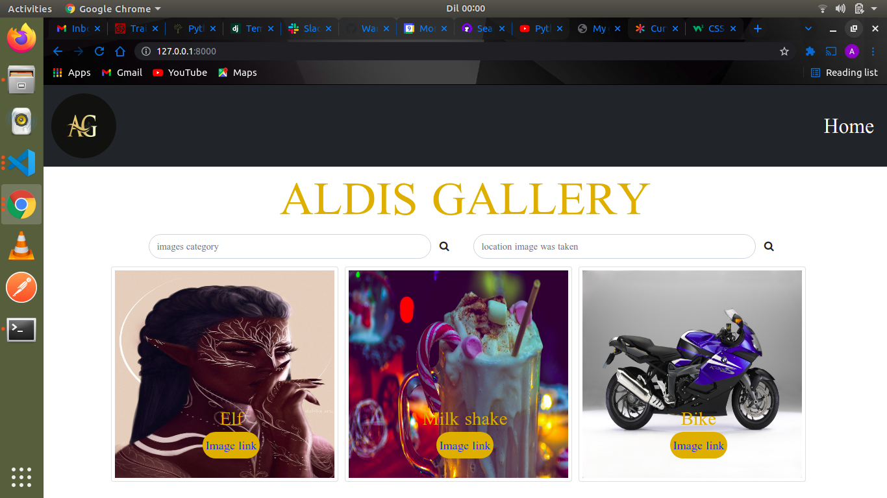
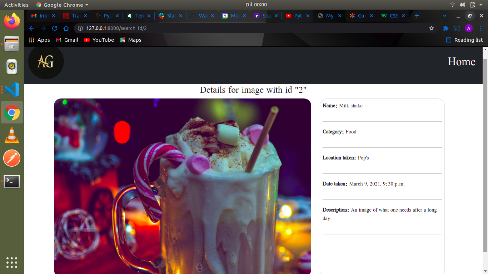
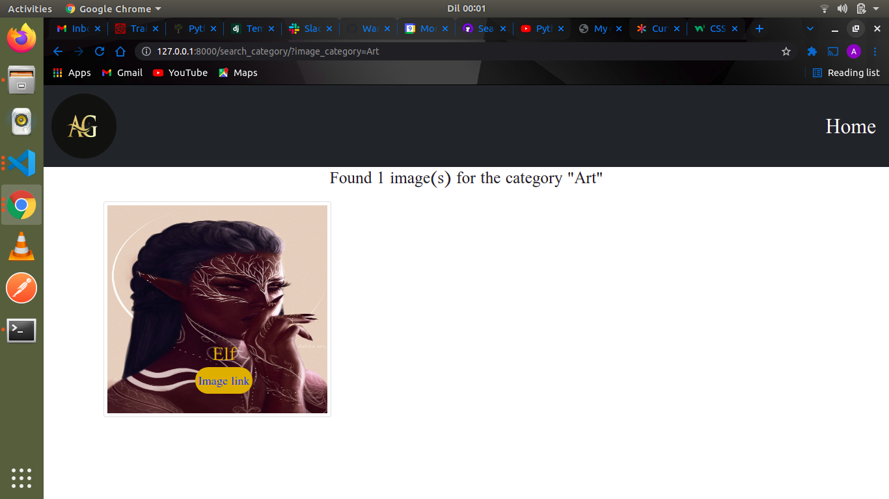
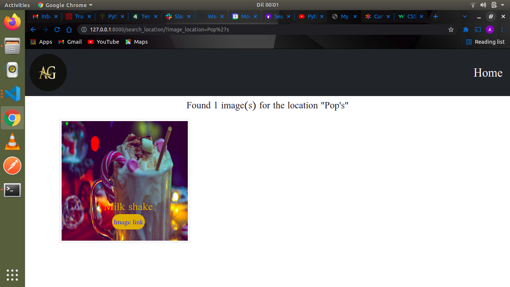

# ALDIS GALLERY
#### By: **Alfred Warui**
## Description of the application
- The application displays several images of different categories and taken in different places thus giving a user a wide variety of pictures to be impressed with.
- A user can filter images and view them in terms of categories and locations taken.
- A user can also get a link to an image and view it whole from a web browser.
## Installation Requirements
* Clone this repository using the link from the clone button
* Open the downloaded folder in a text editor of your preference
* To install virtual environment:
```
$ python3.8 -m venv --without-pip virtual
```
* Activate virtual environment
```
$ source virtual/bin/activate
```
* Install latest pip version inside virtual environment
```
$ curl https://bootstrap.pypa.io/get-pip.py | python
```
* Installing the dependencies
```
$ pip install -r requirements.txt
```
* Starting up the application
```
$ python3.8 manage.py runserver
```

* Open port *http://127.0.0.1:8000/ * to interact with the application
  
## Known Bugs
There are known bugs.
## Technologies Used
* PYTHON
* DJANGO 3.2.8
* HTML5
* CSS
* BOOTSTRAP5
* POSTGRESQL
* MARKDOWN for the *README.md* file
## Some screenshots





## My contacts
Feel free to contact me for assistance if need be or to offer suggestions for improvements.

- Email me:alfredwarui17@gmail.com
- My phone number:0740365281
### License
* *License under [MIT License](LICENSE)*
* Copyright (c) 2021 **Alfred Warui**
